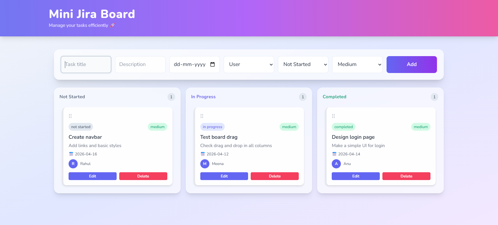

# 🚀 Mini Jira Board

A modern, Jira-inspired task management application built using React.
This project demonstrates advanced frontend skills including drag-and-drop interactions, state management, and clean UI/UX design.

---

## 🌐 Live Demo

👉 mini-jira-board-pf9yfeaem-nageshfularis-projects.vercel.app
---

## 📸 Preview



---

## ✨ Features

### 📝 Task Management

* Create, edit, and delete tasks
* Assign tasks to users
* Set deadlines for tasks
* Priority levels: Low, Medium, High
* Persistent data using localStorage

---

### 📊 Kanban Board

* Organize tasks into:

  * Not Started
  * In Progress
  * Completed
* Real-time updates across columns

---

### 🔄 Drag & Drop (Smooth UX)

* Move tasks between columns
* Reorder tasks within the same column
* Built using `dnd-kit` for performance and smooth interactions

---

### 🎨 UI/UX Highlights

* Modern glassmorphism design
* Gradient header with professional styling
* Responsive layout (desktop + mobile)
* Hover effects & micro-interactions using Framer Motion

---

### ⚙️ State Management

* Global state handled via Context API
* Efficient updates and re-rendering
* LocalStorage integration for persistence

---

## 🛠️ Tech Stack

* **React (Vite)**
* **Tailwind CSS**
* **dnd-kit** (Drag & Drop)
* **Framer Motion** (Animations)

---

## 📁 Project Structure

```bash
src/
│
├── components/
│   ├── Board.jsx
│   ├── Column.jsx
│   ├── TaskCard.jsx
│
├── context/
│   └── TaskContext.jsx
│
├── data/
│   └── dummyData.js
│
├── App.jsx
└── main.jsx
```

---

## ⚙️ Setup Instructions

```bash
git clone https://github.com/nageshfulari/mini-jira-board.git
cd mini-jira-board
npm install
npm run dev
```

---

## 🎯 Assignment Coverage

✔ Jira-like UI and workflow
✔ CRUD operations for tasks
✔ User assignment simulation
✔ Kanban board structure
✔ Smooth drag-and-drop functionality
✔ Responsive and modern UI
✔ Context API for state management

---

## 📌 Author

Nagesh Anil Fulari

---

## 💡 Notes

* No backend used (mock data + localStorage)
* Built as part of a React Frontend Developer Assessment
* Focused on performance, usability, and clean design

---

## 🚀 Future Improvements (Optional)

* Dark mode toggle 🌙
* Task filtering & search 🔍
* Priority sorting
* Modal-based task editing

